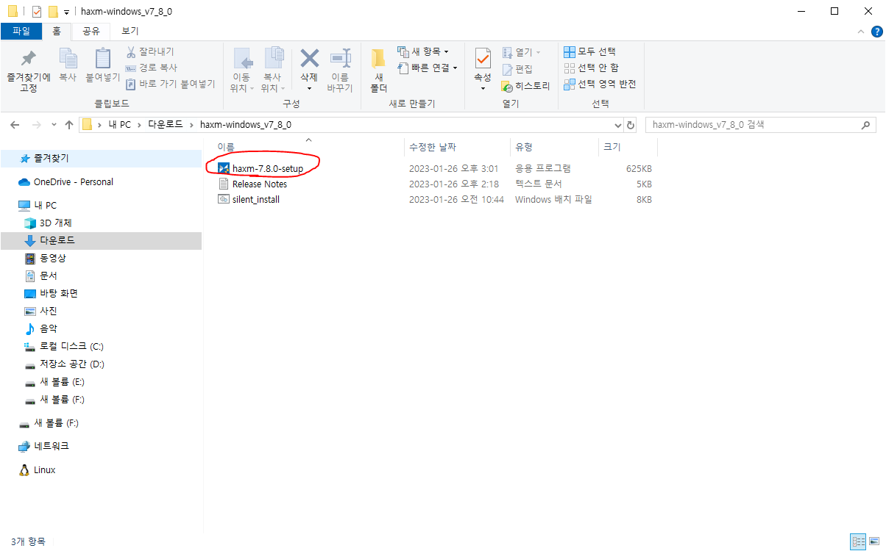
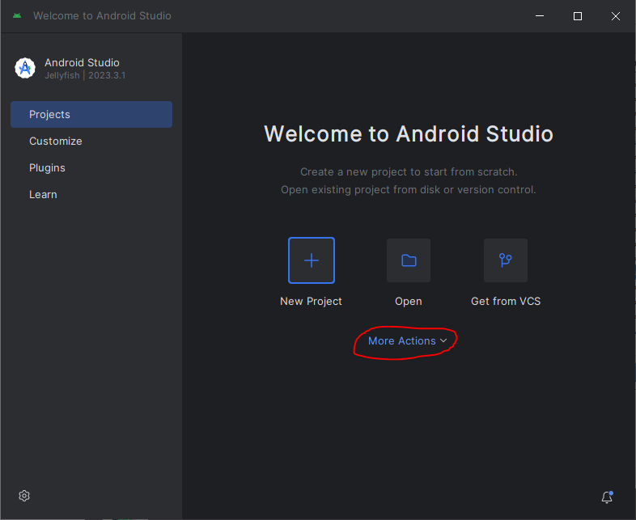
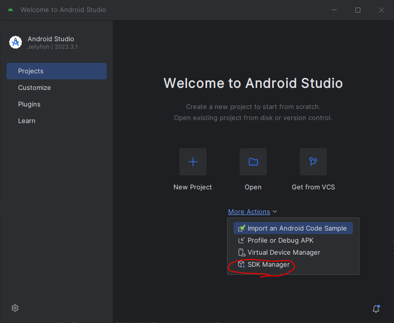
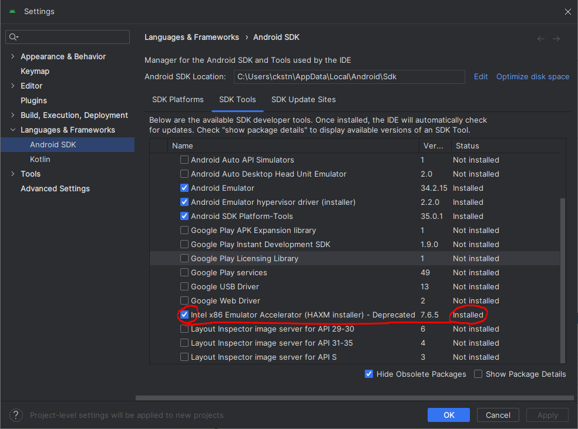

# Android Studio

## Install

> 안드로이드 스튜디오 설치
> https://developer.android.com/studio?hl=ko

## 환경변수 설정

`ANDROID_HOME`의 값으로 `C:\Users\[계정명]\AppData\Local\Android\Sdk`

`PATH`에 값 추가 `C:\Users\[계정명]\AppData\Local\Android\Sdk\platform-tools`

```sh
# 출력[확인]
Get-ChildItem Env:[환경변수 이름]
```

## Error

### HAXM 설치 에러

- `Hyper-V`가 켜져있는지 확인할 것

> HAXM 설치 에러시 다운로드 위치
> https://github.com/intel/haxm/releases



설치 후 SDK Manager에서 확인






