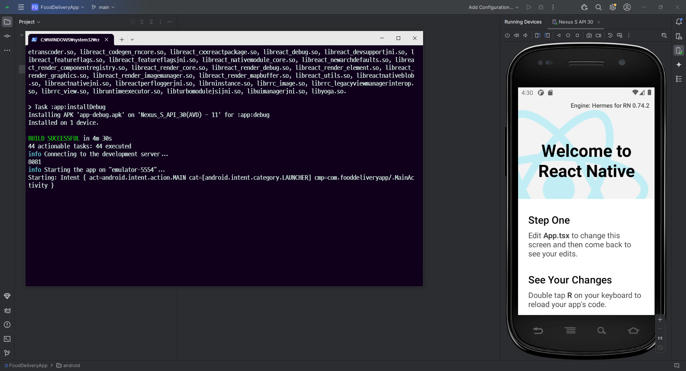

# React-Native

## Install

```sh
npx react-native init [프로젝트명] --template react-native-template-typescript
```

## Start

```sh
npm run android
```

## Error

### Build Error

- JDK 버전 확인

### Emulater Error

- Hyper-V 확인
- HAXM 제대로 깔렸는지 확인

### Error Code 1

```
BUILD FAILED in 1m 41s
error Failed to install the app. Command failed with exit code 1: gradlew.bat app:installDebug -PreactNativeDevServerPort=8081 FAILURE: Build failed with an exception. * What went wrong: java.io.UncheckedIOException: Could not move temporary workspace (C:\Users\ckstn\FoodDeliveryApp\android\.gradle\8.6\dependencies-accessors\423f0288fa7dffe069445ffa4b72952b4629a15a-26017f13-1780-41f5-9eb2-48ba6012539e) to immutable location (C:\Users\ckstn\FoodDeliveryApp\android\.gradle\8.6\dependencies-accessors\423f0288fa7dffe069445ffa4b72952b4629a15a) > Could not move temporary workspace (C:\Users\ckstn\FoodDeliveryApp\android\.gradle\8.6\dependencies-accessors\423f0288fa7dffe069445ffa4b72952b4629a15a-26017f13-1780-41f5-9eb2-48ba6012539e) to immutable location (C:\Users\ckstn\FoodDeliveryApp\android\.gradle\8.6\dependencies-accessors\423f0288fa7dffe069445ffa4b72952b4629a15a) * Try: > Run with --stacktrace option to get the stack trace. > Run with --info or --debug option to get more log output. > Run with --scan to get full insights. > Get more help at https://help.gradle.org. BUILD FAILED in 1m 41s.
```

**해결방법**

```sh
cd android

./gradlew clean

cd ..

npm cache clean --force
```


